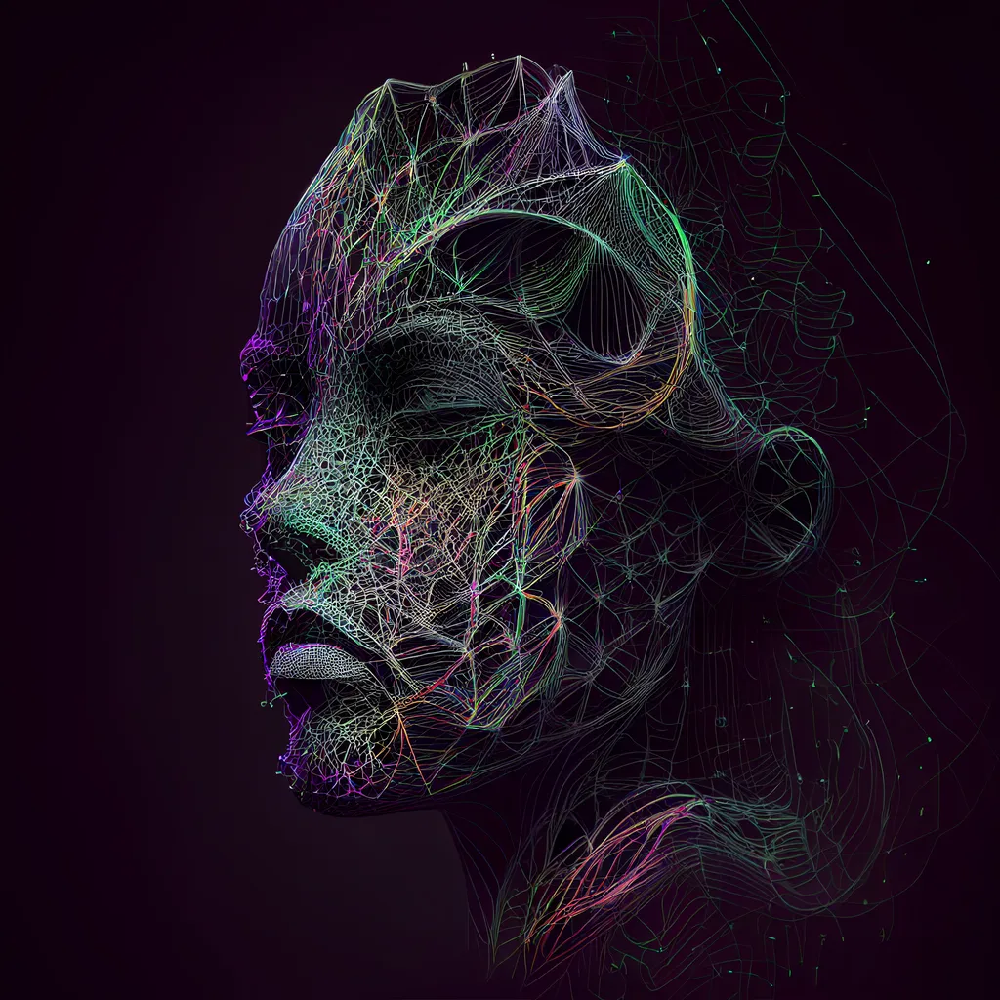

<h1 align="center">
  <br>
  
  <br>
  Different Sounds, Random Radio Discord BOT
  <br>
</h1>

## About The Project

> Just listen music that your algorithm not choose

## Commands

- .join: This command makes the bot access the voice channel
- .start: This command makes the bot start the radio session
- .new: This command makes the bot pass to another new song
- .stop: This command makes the bot end the radio session

## Quick Start

> Follow the next steps

```bash
# Clone this repository
$ git clone https://github.com/raulgalis/differentsounds

# Go into the repository and install the requirements.txt
$ cd differentsounds
$ pip install -r requirements.txt

# Add your private API key for Discogs Account and Discord Aplication
load_dotenv()
API_KEY = os.getenv('discogs')
token = os.getenv('discord')

# Run main.py
$ python main.py
```